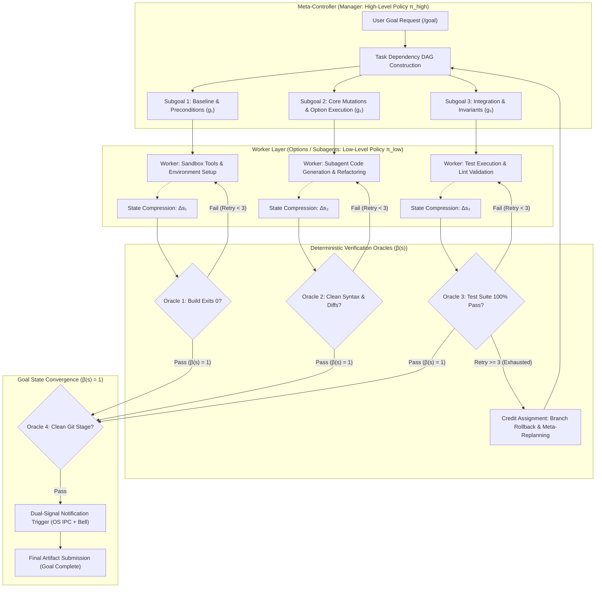

# HRL X Antigravity Goal State Mode

[](https://opensource.org/licenses/Apache-2.0)
[](https://www.python.org/)
[](#execution-architecture)
[](https://github.com/hrlpavan/HRL-X-Antigravity-Goal-State-Mode)
[](https://gitlab.com/hrlpavan/HRL-X-Antigravity-Goal-State-Mode)

> **Enterprise Feudal Hierarchical Reinforcement Learning (HRL) Autonomous Goal Engine for Google Antigravity (`/goal`).**
> Bridges long-horizon task execution, temporal abstraction, worker context compression, bounded credit assignment with automated backtracking, deterministic verification oracles ($\beta(s) = 1$), and dual-signal completion triggers.

---

## 📌 Executive Summary

Traditional LLM agent workflows treat software development as an autoregressive, single-turn chat completion or an unconstrained loop. Under long execution horizons (hours or overnight runs), standard agents predictably fail due to three fundamental flaws:
1. **Context Window Pollution**: Raw terminal logs, compiler traces, and failed grep rollouts saturate the context window, causing catastrophic attention dilution.
2. **Hallucinatory Self-Assessment**: The agent prematurely concludes tasks based on subjective linguistic self-evaluation (*"I have completed all tasks"*) while tests remain broken or unrun.
3. **Infinite Local Thrashing**: The agent gets stuck in unconstrained local error loops, continuously patching symptoms without addressing root architecture.

**HRL X Antigravity Goal State Mode** solves these problems by grounding Google Antigravity's autonomous Goal Mode (`/goal`) in **Feudal Hierarchical Reinforcement Learning** (FeUdal Networks / Options Framework).

---

## 🏛️ Execution Architecture



---

## ⚡ Quickstart

### 1. Install Skill into Google Antigravity
Copy the bundled skill into your Antigravity configuration:
```bash
# Global installation (recommended)
mkdir -p ~/.gemini/config/skills/hrl-goal-engine
cp skills/hrl-goal-engine/SKILL.md ~/.gemini/config/skills/hrl-goal-engine/

# Or workspace-specific installation
mkdir -p .agents/skills/hrl-goal-engine
cp skills/hrl-goal-engine/SKILL.md .agents/skills/hrl-goal-engine/
```

### 2. Run Autonomous Goal Mode
In your Antigravity chat or CLI, initiate your goal with the structured template:

```markdown
/goal
Target Workspace: /path/to/my-project
Primary Objective: Implement rate-limiting middleware with Redis sliding window.

[DETERMINISTIC VERIFICATION ORACLES β(s)]
- Oracle 1 (Build): npm run build (exit code 0)
- Oracle 2 (Tests): npm test tests/rateLimiter.test.ts (0 failures)
- Oracle 3 (Lint): npm run lint (0 errors)
- Oracle 4 (Git): git diff --check (0 conflicts)
```

### 3. Verify Offline with Python Engine
Run the included verification oracle engine:
```bash
python3 engine/verification_oracle.py \
  --build "npm run build" \
  --test "npm test" \
  --lint "npm run lint"
```

---

## 📦 Repository Structure

```
.
├── README.md                                 # High-level overview & quickstart
├── LICENSE                                   # Apache-2.0 License
├── docs/
│   ├── ARCHITECTURE.md                       # Deep mathematical & systems architecture
│   ├── USER_GUIDE.md                         # End-to-end operation & best practices manual
│   ├── VERIFICATION_ORACLES.md               # Deterministic environment verification guide
│   ├── BACKTRACKING_AND_CREDIT_ASSIGNMENT.md # Retry budget, rollback & replanning protocol
│   └── NOTIFICATION_PROTOCOLS.md             # Multi-platform dual-signal alerting
├── engine/
│   ├── __init__.py                           # Python package initialization
│   ├── feudal_controller.py                  # Standalone Meta-Controller & Task DAG runner
│   ├── verification_oracle.py                # Deterministic Oracle verification runner
│   ├── state_compressor.py                   # Context isolation & state differential (Δs) extractor
│   └── notification_trigger.py               # Cross-platform desktop & audio bell dispatcher
├── skills/
│   └── hrl-goal-engine/
│       └── SKILL.md                          # Production Antigravity Skill manifest
├── rules/
│   └── hrl_goal_engine.md                    # Antigravity Persistent Rule specification
├── templates/
│   ├── goal_prompt_v2_1.md                   # Drop-in /goal prompt template v2.1
│   └── examples/
│       ├── redis_rate_limiter_example.md     # Real-world API rate limiter prompt & DAG
│       └── fullstack_migration_example.md    # Real-world DB migration prompt & DAG
├── scripts/
│   ├── verify_goal_state.sh                  # Shell script for deterministic oracle validation
│   └── notify_completion.sh                  # Shell script for cross-platform alerting
└── tests/
    ├── test_feudal_controller.py             # Unit tests for controller & DAG planner
    └── test_verification_oracle.py           # Unit tests for deterministic verification oracles
```

---

## 🔬 Theoretical Foundations

### 1. Semi-Markov Decision Process (SMDP) & Options Framework
Standard reinforcement learning models an agent taking primitive actions $a_t \in \mathcal{A}$ at discrete time steps $t$. In long-horizon software engineering, actions are **temporally extended options**:
$$\omega = \langle \mathcal{I}_\omega, \pi_\omega, \beta_\omega \rangle$$
Where:
- $\mathcal{I}_\omega \subseteq \mathcal{S}$ is the **Initiation Set** (preconditions required to start the option).
- $\pi_\omega: \mathcal{S} \times \mathcal{A} \rightarrow [0, 1]$ is the **Option Policy** (low-level tool executions by subagents).
- $\beta_\omega: \mathcal{S} \rightarrow [0, 1]$ is the **Termination Condition** (the environment state condition triggering option completion).

### 2. Feudal Hierarchy (Manager vs. Worker)
- **Meta-Controller (Manager)**: Operates at coarse temporal resolution ($c$ steps), selecting subgoals $g \in \mathcal{G}$.
- **Worker (Subagent)**: Operates at fine temporal resolution, optimizing intrinsic reward:
  $$r_{\text{intrinsic}}(s, g) = -\|\phi(s) - g\|$$
  Where $\phi(s)$ is the projected state representation.

### 3. Deterministic Verification Gate ($\beta(s) = 1$)
Unlike conversational agents that terminate on linguistic tokens, Antigravity Goal State Mode terminates if and only if the verification oracle yields unity:
$$\beta(s) = \prod_{i=1}^{K} \mathbb{I}(\text{exit\_code}(\text{Oracle}_i) == 0)$$

---

## 🤝 Repositories & Sync

This project is mirrored across both major source control providers:
- **GitHub**: [https://github.com/hrlpavan/HRL-X-Antigravity-Goal-State-Mode](https://github.com/hrlpavan/HRL-X-Antigravity-Goal-State-Mode)
- **GitLab**: [https://gitlab.com/hrlpavan/HRL-X-Antigravity-Goal-State-Mode](https://gitlab.com/hrlpavan/HRL-X-Antigravity-Goal-State-Mode)

---

## 📄 License

Licensed under the [Apache License, Version 2.0](LICENSE).
