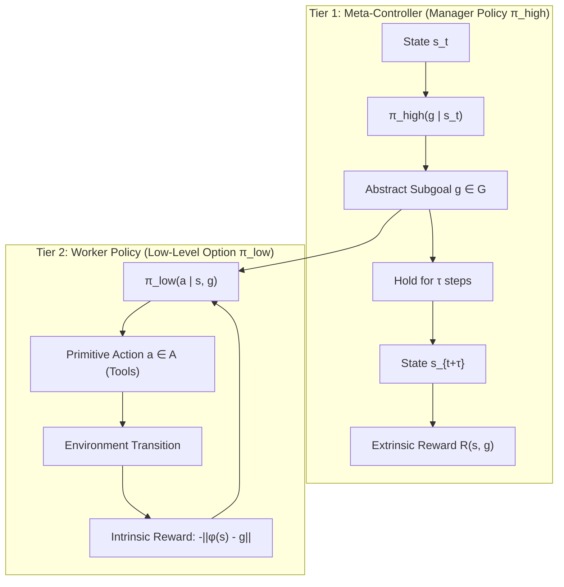
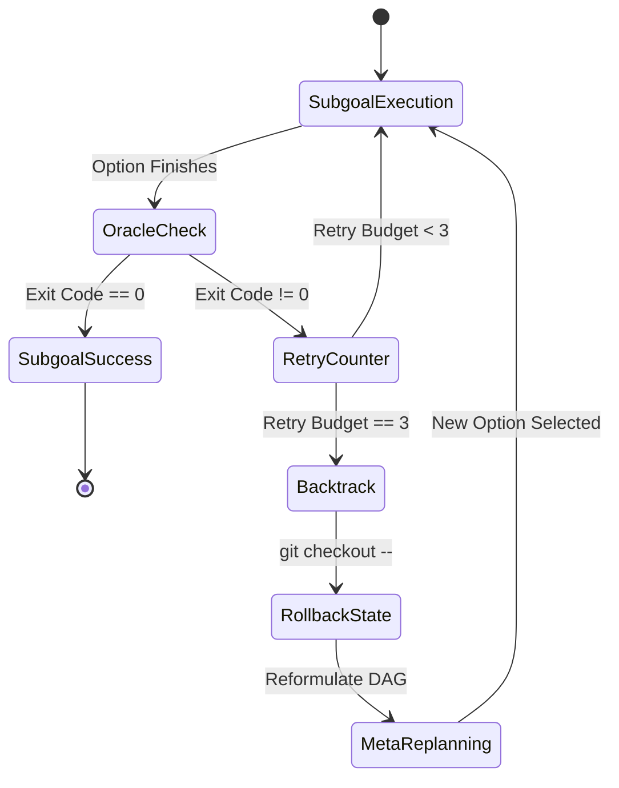

# Execution Architecture: Feudal HRL for Google Antigravity

This document outlines the rigorous mathematical and systems architecture underpinning **HRL X Antigravity Goal State Mode**.

---

## 1. Problem Formulation: The Long-Horizon Horizon Dilemma

In autonomous coding agents, long-horizon software engineering is framed as sequential decision-making over an environment with enormous state spaces (ASTs, dependencies, compilers, file trees, test runners).

Standard single-agent architectures suffer from three fatal pathologies:

```
[Traditional Agent] ──► Action 1 ──► [Huge Raw Logs] ──► Action 2 ──► [Huge Build Errors] ──► [Context Window Collapse]
```

1. **Context Window Collapse (Attention Dilution)**: The ratio of informative signals to noisy intermediate output decays exponentially as execution traces accumulate.
2. **Hallucinatory Termination**: Because the agent acts as its own critic, it easily hallucinates completion when fatigued or confused.
3. **Unbounded Thrashing**: When an error occurs, the agent enters localized hill-climbing on broken assumptions without backtracking to the branch point.

---

## 2. Theoretical Framework

HRL X Antigravity formalizes autonomous development as a **Semi-Markov Decision Process (SMDP)** governed by a two-tiered **Feudal Hierarchy**.



### 2.1 Semi-Markov Decision Process (SMDP)
An SMDP is defined by the tuple $\langle \mathcal{S}, \mathcal{O}, \mathcal{P}, \mathcal{R}, \gamma \rangle$:
* $\mathcal{S}$: State space representing the file tree, ASTs, git status, and environment variables.
* $\mathcal{O}$: Set of temporally extended options $\omega = \langle \mathcal{I}_\omega, \pi_\omega, \beta_\omega \rangle$.
* $\mathcal{P}(s', \tau \mid s, \omega)$: Probability of transitioning to state $s'$ after duration $\tau$ under option $\omega$.
* $\mathcal{R}(s, \omega)$: Expected cumulative reward incurred over the option's execution.
* $\gamma \in (0, 1]$: Temporal discount factor.

### 2.2 The Options Framework
Each sub-task is encapsulated as an option $\omega$:
1. **Initiation Set $\mathcal{I}_\omega \subseteq \mathcal{S}$**: Preconditions required before the option can fire (e.g., dependencies installed, branch checked out).
2. **Internal Policy $\pi_\omega: \mathcal{S} \times \mathcal{A} \rightarrow [0, 1]$**: The local policy dispatched to execute atomic actions (file edits, sandboxed shell runs).
3. **Termination Condition $\beta_\omega: \mathcal{S} \rightarrow [0, 1]$**: The probability that option $\omega$ halts at state $s$.

---

## 3. Systems Realization in Google Antigravity

| Theoretical Element | Antigravity Native Equivalent | Behavioral Mechanics |
| :--- | :--- | :--- |
| **Meta-Controller** | Primary Session Planner | Constructs DAG of milestones, defines verification gates, routes tasks. |
| **Option Policy** | Subagents (`invoke_subagent`) | Forked agent conversations executing isolated tool sequences. |
| **Primitive Actions** | Native Tools | `replace_file_content`, `write_to_file`, sandboxed `run_command`. |
| **State Projection $\phi(s)$** | File System & Git State | AST parsing, uncommitted git diffs, directory trees. |
| **Intrinsic Reward** | Local Subgoal Validation | Unit tests and compiler checks specific to the active option. |
| **Extrinsic Reward** | Global Goal Oracle $\beta(s) = 1$ | Full test suite pass, lint pass, build pass, clean git tree. |

---

## 4. Context Isolation & State Differential ($\Delta s$)

The defining feature of this architecture is **Worker Sandboxing with State Compression**.

Instead of running long terminal exploratory tasks in the root context, the Meta-Controller delegates work to subagents. Subagents run in isolated scratchpads:

```
Root Context:  [Target Goal] ──► [Dispatch Subgoal 1] ───► [Receive Δs₁] ──► [Dispatch Subgoal 2]
                                      │
Subagent Context:              [ls -la]
                               [read 20 files]
                               [compile error]
                               [fix syntax]
                               [tests pass]
                                      │
                               Returns only: Δs = {files_modified: [...], status: "PASS", tests_passed: 12}
```

### Mathematical Formulation of $\Delta s$
$$\Delta s = \langle \mathcal{M}, \mathcal{D}, \mathcal{V} \rangle$$
* $\mathcal{M}$: Set of mutated file paths $\{p_1, p_2, \dots, p_k\}$.
* $\mathcal{D}$: Unified git diff representing the transformation $s \rightarrow s'$.
* $\mathcal{V}$: Vector of local oracle evaluations $[v_1, v_2, \dots, v_m] \in \{0, 1\}^m$.

---

## 5. Bounded Credit Assignment & Backtracking

When an agent fails, standard behavior is to enter a cycle of reactionary patching (*"fix symptom A, create bug B"*). 

HRL X Antigravity enforces **Bounded Credit Assignment**:



### The Backtracking Protocol
1. **Local Retry Counter**: Each subgoal tracks $k \in \{0, 1, 2, 3\}$.
2. **Budget Threshold**: If $k = 3$ without oracle clearance:
   * **Reversion**: Immediate clean rollback of all changes made during option $\omega$:
     ```bash
     git checkout -- <modified_files>
     ```
   * **Meta-Replanning**: The failure is credited to the *option strategy* rather than low-level implementation. The Meta-Controller generates an alternative pathway in the task DAG.

---

## 6. Deterministic Verification Gate ($\beta(s) = 1$)

LLMs are prone to sycophantic or hallucinatory self-assessment. To eliminate this, completion is gated behind four deterministic environment oracles:

$$\beta(s) = \mathbb{I}(\text{Build} == 0) \times \mathbb{I}(\text{Tests} == 0) \times \mathbb{I}(\text{Lint} == 0) \times \mathbb{I}(\text{Stage} == 0)$$

If $\beta(s) = 0$, the session is **forbidden from terminating**. It must either self-repair or trigger the backtracking protocol.

---

## 7. Dual-Signal Notification Protocol

Upon satisfying $\beta(s) = 1$, the agent triggers a non-blocking dual-signal completion alert:
1. **Visual / Desktop IPC**: Dispatches an OS desktop alert (`osascript` on macOS, `notify-send` on Linux).
2. **Auditory Signal**: Emits an audible terminal ASCII bell (`printf '\a'`).
3. **Artifact Convergence**: Emits a structured summary markdown artifact in Antigravity's persistent artifact storage.

---

## 8. Volatile-Action Gating Policy & Auto-Submit Protocol

A critical requirement for autonomous operations is balancing velocity with safety: **How many times must the human press Submit/Enter?**

$$\text{Prompts}(a) = \begin{cases} 0 & \text{if } \mathcal{V}(a) \in \{\text{LOW}, \text{MEDIUM}\} \quad \text{(Auto-Submit)} \\ 1 & \text{if } \mathcal{V}(a) == \text{HIGH} \quad \text{(Interactive Human Gate)} \end{cases}$$

### 8.1 The Zero-Interruption Rule for Standard Tasks (Auto-Submit)
For deterministic, non-destructive actions, the agent **never halts to ask the user to press submit**:
- Creating/editing project files (`write_to_file`, `replace_file_content`).
- Running local compilations, linters, or typecheckers (`tsc`, `py_compile`, `cargo check`).
- Executing local unit or integration tests (`pytest`, `npm test`).
- Making local git commits or switching development feature branches.
*Total prompts incurred: **0**.*

### 8.2 The High-Volatility Boundary ($\mathcal{V}(a) == \text{HIGH}$)
Execution pauses and prompts the user for explicit confirmation **only** if the action violates the volatility safety boundary:
1. **Irreversible Data Destruction**: `DROP TABLE`, `DROP DATABASE`, `TRUNCATE`, broad `DELETE FROM` without constraints.
2. **Remote History Disruption**: `git push --force` or force-deleting branches on protected remotes (`main`, `master`, `prod`).
3. **Destructive Cloud Deletions**: Deleting cloud projects, databases, storage buckets (`gsutil rm -r`), or KMS encryption keys.
4. **Permanent File Obliteration Outside Workspace**: Executing broad `rm -rf /` or recursive deletions targeting home/root directories.

Under this policy, simple projects run end-to-end with **0 manual submit prompts**, while destructive changes are guarded behind an ironclad confirmation gate.
